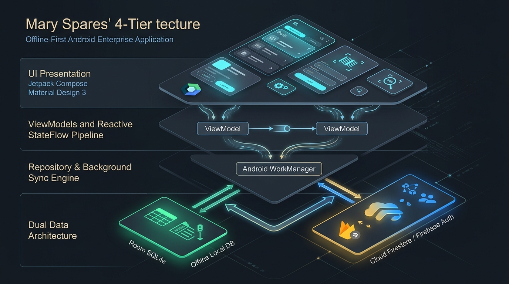
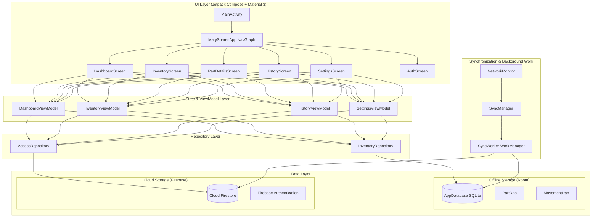

# 🏍️ Mary Spares — Stock & Inventory Manager

<div align="center">

[-3DDC84?style=for-the-badge&logo=android&logoColor=white)](https://developer.android.com)
[](https://kotlinlang.org)
[](https://developer.android.com/jetpack/compose)
[-4285F4?style=for-the-badge&logo=sqlite&logoColor=white)](https://developer.android.com/training/data-storage/room)
[](https://firebase.google.com)
[](https://developer.android.com/topic/libraries/architecture/workmanager)
[](LICENSE)

<p align="center">
  <b>A robust, enterprise-grade, offline-first Android inventory management solution specifically architected for two-wheeler spare parts dealerships, automobile workshops, and retail counters.</b>
</p>

[Key Features](#-key-features) • [Architecture](#-architecture) • [Database Schema](#-database-schema) • [Fuzzy Search](#-intelligent-fuzzy-search) • [Getting Started](#-getting-started) • [Security & RBAC](#-security--role-based-access-control) • [Data Export](#-data-portability--backup)

</div>

---

## 📖 Overview

Operating an automobile spare parts business requires immediate access to thousands of Stock Keeping Units (SKUs), fast counter lookups, accurate bin/shelf locations, and resilient stock audits—often in workshops and storerooms with unreliable connectivity.

**Mary Spares** solves these operational challenges by implementing an **offline-first local cache** powered by Room SQLite, combined with **background bi-directional cloud synchronization** via Firebase Firestore and Android WorkManager. Whether internet is active or severed, shop owners and counter staff can search parts, issue stock, receive batches, adjust physical counts, and generate analytical CSV reports without delay.

---

## ✨ Key Features

| Category | Capability | Technical Details |
| :--- | :--- | :--- |
| **⚡ Offline-First Architecture** | Uninterrupted counter sales & audits | Full SQLite Room local database with Kotlin Coroutines and reactive `StateFlow` streaming. |
| **🔄 Background Cloud Sync** | Continuous multi-device consistency | Android WorkManager worker with mutex-locked synchronization, exponential backoff, and soft-delete propagation. |
| **🔍 Intelligent Fuzzy Search** | Fault-tolerant parts retrieval | Custom Damerau-Levenshtein distance algorithm handling typos, transpositions, and tokenized SKU part numbers. |
| **📦 Granular Stock Movements** | Complete stock audit trail | Strict tracking of `ADD` (Restock), `SUBTRACT` (Sale/Issue), and `ADJUST` (Physical Reconciliation) with audit snapshots. |
| **💰 Integer-Precision Pricing** | Eliminates rounding discrepancies | Selling Price and MRP stored in paise (integers) to prevent IEEE-754 floating-point inaccuracies. |
| **🛡️ Role-Based Access Control** | Secure team collaboration | Multi-tier privileges (`OWNER`, `ADMIN`, `STAFF`) with Firebase Authentication, Google Sign-In, and real-time invitation management. |
| **🚨 Dynamic Stock Alerts** | Proactive stockout prevention | Real-time threshold monitoring distinguishing Healthy, Low Stock, and Out-of-Stock items with quick action sheets. |
| **📊 Backup & Export Engine** | Seamless auditing & data export | Direct CSV sharing via Android Intent and full 4-collection database archive export (.ZIP) using Storage Access Framework (SAF). |
| **🎨 Material 3 Design** | Modern, accessible user interface | Edge-to-edge Compose layouts, dynamic theming (Light / Dark / System), zero-flash window backgrounds, and persistent DataStore preferences. |

---

## 🏗️ Architecture

Mary Spares adheres strictly to **Clean Architecture** principles and the modern Android **MVVM (Model-View-ViewModel)** architectural pattern.

<p align="center">
  
</p>



### Architectural Highlights
- **Single Source of Truth (SSOT)**: The local Room database serves as the SSOT for all UI screens. ViewModels observe Room via `Flow`, ensuring the UI reflects changes instantly.
- **Transactional Consistency**: Adjustments, additions, and subtractions write both a Part update and a corresponding `MovementRecord` atomically within database transactions.
- **Mutex Sync Guarantee**: `SyncWorker` uses an in-process Coroutine Mutex to prevent overlapping synchronization routines from creating race conditions or duplicate network writes.

---

## 🔍 Intelligent Fuzzy Search Engine

Finding parts in a busy workshop requires tolerance for abbreviations, phonetic spellings, and hasty typing. Mary Spares includes a custom-built, zero-dependency search engine located in [`FuzzySearchEngine.kt`](app/src/main/java/com/marytwowheelers/spares/util/FuzzySearchEngine.kt).

### Scoring Strategy
1. **Exact Matches (1000 pts)**: Identical part name or OEM part number.
2. **Prefix Matches (800–900 pts)**: Immediate prefix matching on query string.
3. **Substring Matches (700 pts)**: Query found anywhere within the combined token string.
4. **Typo Tolerance via Damerau-Levenshtein**:
   - Handles insertions (`brakke` $\rightarrow$ `brake`), deletions (`brke` $\rightarrow$ `brake`), substitutions (`bruke` $\rightarrow$ `brake`), and transpositions (`baer` $\rightarrow$ `bear`).
   - Dynamic edit-distance scaling based on token length:
     - 1–3 characters: max distance 1
     - 4–6 characters: max distance 2
     - 7+ characters: configurable threshold
   - Cross-matches multi-word titles and part numbers (e.g., `cr7e spark` finds `Spark Plug (NGK - CR7E)`).

---

## 🗄️ Database Schema

### Local Storage (Room SQLite)

#### `parts` Table
| Column | Type | Description |
| :--- | :--- | :--- |
| `id` | `TEXT (PK)` | Unique UUID identifier |
| `serialNumber` | `INTEGER` | Sequential numerical identifier |
| `name` | `TEXT` | Part title / commercial description |
| `partNumber` | `TEXT` | Manufacturer / OEM part number |
| `shelfLocation` | `TEXT` | Rack, bin, or shelf coordinate (e.g., `R2-B4`) |
| `sellingPricePaise` | `INTEGER` | Retail price stored in paise (₹1.00 = 100 paise) |
| `mrpPaise` | `INTEGER` | Maximum Retail Price in paise |
| `isDeleted` | `INTEGER (Boolean)` | Soft-deletion flag for cloud sync tombstones |
| `updatedAt` | `INTEGER` | Millisecond Unix timestamp |
| `syncState` | `TEXT` | Sync enum: `PENDING` or `SYNCED` |

#### `movements` Table
| Column | Type | Description |
| :--- | :--- | :--- |
| `id` | `TEXT (PK)` | Unique UUID identifier |
| `partId` | `TEXT` | Foreign reference to `parts.id` |
| `delta` | `INTEGER` | Positive or negative quantity delta |
| `type` | `TEXT` | Movement classification: `ADD`, `SUBTRACT`, or `ADJUST` |
| `reason` | `TEXT` | Context note (e.g., "Counter sale", "Damaged unit", "Physical stock count") |
| `snapshotCount` | `INTEGER?` | Exact physical count verified by user during `ADJUST` audits |
| `previousRecordedStock`| `INTEGER?` | Pre-adjustment stock level at the time of reconciliation |
| `timestamp` | `INTEGER` | Millisecond Unix timestamp |
| `syncState` | `TEXT` | Sync enum: `PENDING` or `SYNCED` |

---

### Cloud Firestore Structure
```text
cloud_firestore
 ├── parts/                     # Shared catalog across dealership terminals
 │    └── {partId}              # PartEntity documents (with soft-delete flag)
 ├── movements/                 # Immutable stock movement transaction logs
 │    └── {movementId}          # MovementRecord documents
 ├── users/                     # Registered app users & current roles
 │    └── {uid}                 # User profile, role (OWNER/ADMIN/STAFF), status
 └── invitations/               # Team member access invitations
      └── {invitationId}        # Invited email, role, issuer, status
```

---

## 🛡️ Security & Role-Based Access Control (RBAC)

Access permissions are enforced on both the client side and through Firestore Security Rules:

```
                  ┌──────────────────────┐
                  │        OWNER         │ Full System Authority
                  └──────────┬───────────┘
                             │
                  ┌──────────▼───────────┐
                  │        ADMIN         │ User Invites, Cloud Backups,
                  └──────────┬───────────┘ Full Catalog Edits
                             │
                  ┌──────────▼───────────┐
                  │        STAFF         │ Counter Sales, Stock In/Out,
                  └──────────────────────┘ Search & Read-Only Catalog
```

- **Owner**: Complete authority over store settings, role promotions, and critical record purging.
- **Admin**: Invites and manages staff members, triggers database backup exports, manages inventory pricing and part additions.
- **Staff**: Searches inventory, views shelf locations, records stock movements (`ADD`/`SUBTRACT`), and audits quantities.

---

## 📊 Data Portability & Backup

Located in [`CsvExporter.kt`](app/src/main/java/com/marytwowheelers/spares/util/CsvExporter.kt):

1. **Instant Inventory CSV**:
   - Generates a timestamped `.csv` file featuring Serial Number, Part Name, Part Number, Shelf Location, Current Quantity, Selling Price, MRP, and Stock Status.
   - Dispatches via Android `FileProvider` to share directly to WhatsApp, Gmail, Google Drive, or printer services.
2. **Full Cloud Database ZIP Archive**:
   - Uses Android **Storage Access Framework (SAF)** to let administrators choose an exact backup location on local storage, SD card, or USB OTG.
   - Packages four structured CSV datasets into a single compressed `.zip`:
     - `parts.csv`
     - `movements.csv`
     - `users.csv`
     - `invitations.csv`

---

## 🚀 Getting Started

### Prerequisites
- **Android Studio**: Ladybug (2024.2.1) or newer
- **JDK**: Java 17 or Java 21
- **Android SDK**: `compileSdk = 37`, `minSdk = 24` (Supports Android 7.0 Nougat through Android 15+)
- **Firebase Account**: Cloud Firestore & Firebase Auth enabled

### Installation & Setup

1. **Clone the Repository**:
   ```bash
   git clone https://github.com/jinsu-2005/MarySpares-Stock-Manager.git
   cd MarySpares-Stock-Manager
   ```

2. **Configure Firebase**:
   - Create a project in the [Firebase Console](https://console.firebase.google.com).
   - Enable **Firebase Authentication** (Email/Password and Google Sign-In providers).
   - Enable **Cloud Firestore** and deploy rules from [`firestore.rules`](firestore.rules).
   - Download your `google-services.json` file and place it in the `app/` directory:
     ```text
     MarySpares/
     └── app/
          └── google-services.json
     ```

3. **Build the Project**:
   ```bash
   # On Windows PowerShell
   .\gradlew.bat assembleDebug

   # On macOS / Linux
   ./gradlew assembleDebug
   ```

4. **Run on Device / Emulator**:
   Connect an Android device with USB debugging enabled or launch an Android Virtual Device (AVD), then execute:
   ```bash
   .\gradlew.bat installDebug
   ```

---

## 📂 Project Structure

```text
app/src/main/
 ├── AndroidManifest.xml
 ├── java/com/marytwowheelers/spares/
 │    ├── MainActivity.kt                  # Entry point with zero-flash window theme setup
 │    ├── MarySparesApplication.kt         # Application class
 │    ├── data/
 │    │    ├── local/                      # Room DB, PartEntity, MovementEntity, DAOs
 │    │    ├── model/                      # Domain models (PartWithStock, MovementRecord, AccessMember)
 │    │    └── repository/                 # InventoryRepository & AccessRepository
 │    ├── sync/
 │    │    ├── AppSyncStatus.kt            # Sync state indicators
 │    │    ├── SyncManager.kt              # WorkManager enqueueing & StateFlow streams
 │    │    └── SyncWorker.kt               # Mutex-protected push/pull cloud sync worker
 │    ├── ui/
 │    │    ├── components/                 # AddPartDialog, StockActionDialog, StockAlertDialog
 │    │    ├── navigation/                 # Jetpack Compose NavGraph & screen destinations
 │    │    ├── screens/                    # Dashboard, Inventory, History, Settings, Auth
 │    │    ├── theme/                      # Color, Type, Material 3 Theme & DataStore Preference
 │    │    └── viewmodels/                 # MVVM ViewModels and Factory
 │    └── util/
 │         ├── CsvExporter.kt              # SAF Zip & CSV export utilities
 │         ├── FuzzySearchEngine.kt        # Damerau-Levenshtein search implementation
 │         └── NetworkMonitor.kt           # Real-time network connectivity state flow
 └── res/                                  # Drawables, mipmaps, XML configurations & strings
```

---

## 🤝 Contributing

Contributions, issues, and feature requests are welcome!

1. Fork the Project
2. Create your Feature Branch (`git checkout -b feature/AmazingFeature`)
3. Commit your Changes (`git commit -m 'Add some AmazingFeature'`)
4. Push to the Branch (`git push origin feature/AmazingFeature`)
5. Open a Pull Request

---

## 📄 License

Distributed under the **MIT License**. See [`LICENSE`](LICENSE) for more information.

---

<div align="center">
  <sub>Crafted with ❤️ by <a href="https://github.com/jinsu-2005">Jinsu</a> for Mary Two Wheelers Spares.</sub>
</div>
