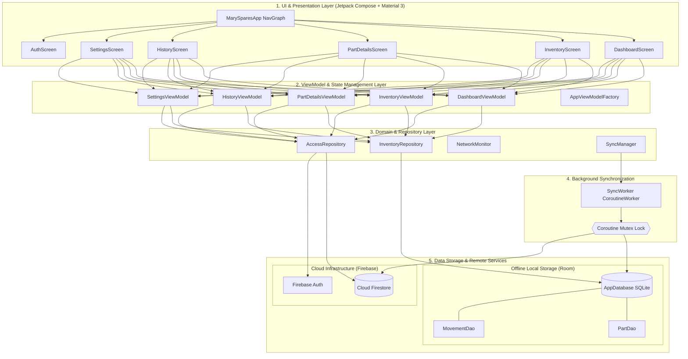

# 🏍️ Mary Spares — Stock & Inventory Manager

<div align="center">

[-3DDC84?style=for-the-badge&logo=android&logoColor=white)](https://developer.android.com)
[](https://kotlinlang.org)
[](https://developer.android.com/jetpack/compose)
[-4285F4?style=for-the-badge&logo=sqlite&logoColor=white)](https://developer.android.com/training/data-storage/room)
[](https://firebase.google.com)
[](https://developer.android.com/topic/libraries/architecture/workmanager)
[](LICENSE)

<p align="center">
  <b>A production-grade, offline-first Android inventory and counter sales management solution specifically engineered for two-wheeler spare parts dealerships, automobile workshops, and high-frequency retail spare counters.</b>
</p>

[Key Features](#-key-features) • [System Architecture](#-system-architecture) • [Synchronization Engine](#-bi-directional-synchronization-engine) • [Intelligent Fuzzy Search](#-intelligent-fuzzy-search-engine) • [Database Schema](#-database-schema) • [Security & RBAC](#-security--role-based-access-control-rbac) • [Data Portability & Backup](#-data-portability--backup-engine) • [Getting Started](#-getting-started) • [Roadmap](#-roadmap)

</div>

---

## 📖 Executive Summary

Managing an automobile spare parts business requires immediate lookups across thousands of Stock Keeping Units (SKUs), fast counter dispatches, accurate rack and shelf coordinate mapping, and reliable stock audits—often in workshops, basements, and rural storerooms where internet connectivity is erratic or absent.

**Mary Spares** is architected from the ground up on an **offline-first local database foundation** using Android Room SQLite, coupled with **background bi-directional cloud synchronization** via Google Cloud Firestore and Android WorkManager. Counter staff and dealership owners can register parts, issue sales, receive restock shipments, perform physical count reconciliations, and generate multi-table audit archives without a millisecond of network latency. When connectivity resumes, changes seamlessly converge in the cloud with zero manual intervention.

---

## ✨ Key Features

| Category | Feature | Highlights & Capabilities |
| :--- | :--- | :--- |
| **⚡ Architecture** | **Offline-First & Instantaneous** | 100% of read and write operations execute locally on Room SQLite before syncing. Instant UI updates driven by Kotlin Coroutines and reactive `StateFlow`. |
| **🔄 Synchronization** | **Bi-Directional Cloud Sync** | Android WorkManager-driven sync with mutex mutual exclusion, Last-Write-Wins (LWW) conflict resolution, and tombstone-based soft-deletion. |
| **🔍 Search** | **Damerau-Levenshtein Fuzzy Search** | Custom zero-dependency search engine handling phonetic typos, character swaps, abbreviations, and composite queries (e.g., `cr7e ngk`). |
| **📦 Movements** | **Immutable Audit Trail** | Granular recording of `ADD` (Restock), `REMOVE` (Sale/Issue), `RETURN` (Customer Return), and `ADJUST` (Physical Count Reconciliation with audit snapshots). |
| **💰 Precision** | **Integer-Centric Pricing** | Selling Price and MRP stored in paise (integers) to eliminate IEEE-754 floating-point inaccuracies during fiscal aggregations. |
| **🛡️ Access Control** | **Multi-Tier RBAC** | Fine-grained roles (`ADMIN`, `OWNER`, `STAFF`, `RELATIVE`, `FRIEND`) secured via Firebase Authentication, Google Sign-In, and strict Firestore Security Rules. |
| **🚨 Alerts** | **Smart Stock Alert Engine** | Real-time threshold monitoring with persistent acknowledgement caching (`StockAlertManager`) that re-triggers only when stock levels fluctuate. |
| **📊 Portability** | **Multi-Format Backup & Export** | One-tap CSV sharing via Android `FileProvider` (WhatsApp/Email/Drive) and full 4-collection database archive export (`.ZIP`) via Storage Access Framework (SAF). |
| **🎨 User Interface** | **Material 3 & Zero-Flash Theming** | Fully responsive edge-to-edge Jetpack Compose UI supporting Light, Dark, and System modes with persistent Jetpack DataStore preferences. |
| **⏱️ Retention** | **Configurable Log Retention** | Automated movement log purging with policies: 90 Days, 6 Months, 1 Year, Custom, or Indefinite retention. |

---

## 🏗️ System Architecture

Mary Spares adheres strictly to **Clean Architecture** principles and the modern Android **MVVM (Model-View-ViewModel)** architectural pattern.

<p align="center">
  
</p>

### Architectural Layers



### Core Architecture Highlights

1. **Single Source of Truth (SSOT)**: The local Room database is the authoritative source of truth for the entire user interface. Screens observe SQLite tables through reactive Kotlin `Flow`s, guaranteeing sub-millisecond screen transitions even in air-gapped workshop environments.
2. **Transactional Movement Ledger**: Adjustments and counter dispatches do not directly rewrite stock levels in isolation. Instead, atomic database transactions record an immutable `MovementEntity` while updating the part's synchronization state.
3. **Mutex-Guarded Background Worker**: `SyncWorker` leverages a shared in-process Coroutine `Mutex` to prevent concurrent sync calls, eliminating race conditions between manual user refreshes and WorkManager periodic sweeps.

---

## 🔄 Bi-Directional Synchronization Engine

The synchronization pipeline guarantees eventual consistency across multiple workshop terminals while prioritizing local responsiveness.

```mermaid
sequenceDiagram
    autonumber
    actor User as Counter Staff
    participant UI as Jetpack Compose UI
    participant Room as Local Room Database
    participant WM as Android WorkManager (SyncWorker)
    participant Cloud as Cloud Firestore

    User->>UI: Record Stock Sale (-2 Units)
    UI->>Room: Insert MovementEntity (delta: -2, PENDING)
    Room-->>UI: Reactive Flow emits updated local stock (Instant UI feedback)
    
    rect rgb(30, 41, 59)
        Note over WM,Cloud: Background Sync Cycle (Triggered by Network or Timer)
        WM->>WM: Acquire in-process Mutex Lock
        WM->>Room: Query pending Parts & Movements (syncState = PENDING)
        WM->>Cloud: PUSH: Write pending entities to /parts and /movements
        Cloud-->>WM: Write Acknowledged
        WM->>Room: Mark pushed records as SYNCED
        
        WM->>Cloud: PULL: Fetch remote updates (where updatedAt > lastSync)
        Cloud-->>WM: Return modified documents
        WM->>Room: Merge remote entities via Last-Write-Wins (LWW)
        WM->>WM: Release Mutex Lock
    end

    Room-->>UI: Emit any converged remote updates to ViewModels
```



### Conflict Resolution & Deletion Handling
- **Last-Write-Wins (LWW)**: Updates to catalog details (pricing, part name, shelf coordinates) are resolved based on the microsecond Unix timestamp (`updatedAt`).
- **Tombstone Soft Deletion**: When an item is deleted, `isDeleted = true` is set and synced to the cloud. This ensures other client terminals mark the item as deleted rather than re-inserting it.
- **Append-Only Movement Ledger**: Transaction logs (`movements`) are strictly additive. Each stock modification is an immutable event, preventing conflicting writes across multi-counter operations.

---

## 🔍 Intelligent Fuzzy Search Engine

In busy workshops, mechanics and counter personnel often search with incomplete part numbers, phonetically spelled brand names, or transposed characters. Mary Spares embeds a custom, zero-dependency search engine located in [`FuzzySearchEngine.kt`](app/src/main/java/com/marytwowheelers/spares/util/FuzzySearchEngine.kt).

### Scoring Matrix

```
┌───────────────────────────────────────────────────────────┐
│                    Search Query Input                     │
└─────────────────────────────┬─────────────────────────────┘
                              │
         ┌────────────────────┼────────────────────┐
         ▼                    ▼                    ▼
  Exact Full Match    Part Number Prefix    Part Name Prefix
    (1,000 pts)           (900 pts)            (800 pts)
         │                    │                    │
         └────────────────────┼────────────────────┘
                              ▼
                      Substring Match
                         (700 pts)
                              ▼
                   Token-by-Token Matching
         ┌────────────────────┴────────────────────┐
         ▼                                         ▼
   Exact Token Match                       Fuzzy Typo Match
       (500 pts)                       (250 - [Distance × 60])
```

### Typo Tolerance via Damerau-Levenshtein
The engine handles four classic clerical input errors:
1. **Insertions**: `brakke` $\rightarrow$ `brake`
2. **Deletions**: `brke` $\rightarrow$ `brake`
3. **Substitutions**: `bruke` $\rightarrow$ `brake`
4. **Transpositions**: `baer` $\rightarrow$ `bear` / `cr7e` $\rightarrow$ `c7re`

### Dynamic Tolerance Scaling
| Token Length | Max Allowed Edit Distance | Example Resolution |
| :--- | :---: | :--- |
| **1 – 3 Characters** | **1** | `c7r` $\rightarrow$ `cr7` |
| **4 – 6 Characters** | **2** | `cluch` $\rightarrow$ `clutch` |
| **7+ Characters** | **2 – 3** | `suspensn` $\rightarrow$ `suspension` |

---

## 🗄️ Database Schema

### Local Storage (Room SQLite)

#### 1. `parts` Table
Represents master SKU records stored locally on the Android device.

```sql
CREATE TABLE parts (
    id TEXT PRIMARY KEY NOT NULL,
    serialNumber INTEGER NOT NULL,
    name TEXT NOT NULL,
    partNumber TEXT NOT NULL,
    shelfLocation TEXT NOT NULL,
    sellingPricePaise INTEGER NOT NULL,
    mrpPaise INTEGER NOT NULL,
    isDeleted INTEGER NOT NULL DEFAULT 0,
    updatedAt INTEGER NOT NULL,
    syncState TEXT NOT NULL DEFAULT 'PENDING'
);
```

#### 2. `movements` Table
Immutable ledger tracking physical inventory changes and reconciliations.

```sql
CREATE TABLE movements (
    id TEXT PRIMARY KEY NOT NULL,
    partId TEXT NOT NULL,
    delta INTEGER NOT NULL,
    type TEXT NOT NULL, -- 'ADD', 'REMOVE', 'RETURN', 'ADJUST'
    reason TEXT,
    snapshotCount INTEGER,
    previousRecordedStock INTEGER,
    timestamp INTEGER NOT NULL,
    syncState TEXT NOT NULL DEFAULT 'PENDING'
);
```

---

### Cloud Firestore Architecture

```text
cloud_firestore
 ├── parts/
 │    └── {partId}
 │         ├── id: string (UUID)
 │         ├── serialNumber: number
 │         ├── name: string
 │         ├── partNumber: string
 │         ├── shelfLocation: string (e.g., "Rack 3 - Bin B")
 │         ├── sellingPricePaise: number (Long)
 │         ├── mrpPaise: number (Long)
 │         ├── isDeleted: boolean
 │         ├── updatedAt: timestamp
 │         └── syncState: string ("SYNCED")
 │
 ├── movements/
 │    └── {movementId}
 │         ├── id: string (UUID)
 │         ├── partId: string (FK -> parts/{partId})
 │         ├── delta: number (+/- quantity)
 │         ├── type: string ("ADD" | "REMOVE" | "RETURN" | "ADJUST")
 │         ├── reason: string?
 │         ├── snapshotCount: number? (Audited count)
 │         ├── previousRecordedStock: number?
 │         ├── timestamp: timestamp
 │         └── syncState: string ("SYNCED")
 │
 ├── users/
 │    └── {uid}
 │         ├── uid: string (Auth UID)
 │         ├── email: string
 │         ├── displayName: string
 │         ├── role: string ("ADMIN" | "OWNER" | "STAFF" | "RELATIVE" | "FRIEND")
 │         ├── status: string ("ACTIVE" | "PENDING" | "REVOKED")
 │         ├── authProvider: string ("Google" | "Email")
 │         └── updatedAt: timestamp
 │
 └── invitations/
      └── {email}
           ├── email: string (lowercase)
           ├── name: string
           ├── role: string
           ├── status: string ("PENDING" | "ACCEPTED")
           ├── invitedBy: string
           └── createdAt: timestamp
```

---

## 🛡️ Security & Role-Based Access Control (RBAC)

Mary Spares features a dual-layer security model: **client-side UI state gating** and **server-side Firestore Security Rules**.

### Role Permission Matrix

| Operational Capability | OWNER | ADMIN | STAFF | RELATIVE | FRIEND |
| :--- | :---: | :---: | :---: | :---: | :---: |
| **Search & Catalog Lookup** | ✅ | ✅ | ✅ | ✅ | ✅ |
| **Record Stock Movement (`ADD`/`REMOVE`/`RETURN`)** | ✅ | ✅ | ✅ | ✅ | ✅ |
| **Physical Stock Count Reconciliation (`ADJUST`)** | ✅ | ✅ | ✅ | ❌ | ❌ |
| **Add New Parts / Edit Catalog Details** | ✅ | ✅ | ❌ | ❌ | ❌ |
| **Export Inventory CSV** | ✅ | ✅ | ✅ | ✅ | ❌ |
| **Export Full Database ZIP Backup (SAF)** | ✅ | ✅ | ❌ | ❌ | ❌ |
| **Manage Team Members & Dispatch Invitations** | ✅ | ✅ | ❌ | ❌ | ❌ |
| **Configure Movement History Retention** | ✅ | ✅ | ❌ | ❌ | ❌ |
| **Reset Local Device Room Database** | ✅ | ✅ | ❌ | ❌ | ❌ |
| **Purge Cloud Firestore Database** | ❌ | ✅ | ❌ | ❌ | ❌ |

### Firestore Security Enforcement
Rules enforce authorized mutations on the database level:
- Whitelist authorization verified against the `/invitations` collection.
- Privilege escalation prevention (users cannot elevate their own role).
- Destructive catalog deletions restricted exclusively to `ADMIN` and `OWNER`.
- Cloud collection purges restricted to root `ADMIN`.

---

## 📊 Data Portability & Backup Engine

The data export engine in [`CsvExporter.kt`](app/src/main/java/com/marytwowheelers/spares/util/CsvExporter.kt) provides enterprise data portability:

```
┌────────────────────────────────────────────────────────────┐
│                    Export Orchestrator                     │
└─────────────────────────────┬──────────────────────────────┘
                              │
       ┌──────────────────────┴──────────────────────┐
       ▼                                             ▼
  Instant Inventory CSV                    Full Cloud Archive ZIP
  • Serial Number                           • parts.csv
  • Part Name & Part Number                 • movements.csv
  • Shelf / Rack Coordinates                • users.csv
  • Quantity & Stock Status                 • invitations.csv
  • Selling Price & MRP (INR)                        │
       │                                             ▼
       ▼                             Storage Access Framework (SAF)
  Android Intent / FileProvider      • USB OTG Drive / Pendrive
  • WhatsApp Dispatch                • Local Documents Storage
  • Gmail / Drive Backup             • SD Card Backup Target
```

---

## 💻 Tech Stack & Dependencies

| Layer / Domain | Technology | Version | Purpose |
| :--- | :--- | :--- | :--- |
| **Language** | [Kotlin](https://kotlinlang.org) | `2.0.21` | Modern, null-safe, coroutine-native language |
| **UI Framework** | [Jetpack Compose BOM](https://developer.android.com/jetpack/compose) | `2026.02.01` | Declarative UI toolkit |
| **Design System** | [Material 3](https://m3.material.io) | Latest | Modern Material Design components & dynamic color |
| **Architecture** | Modern Android MVVM | Architecture Components | Reactive ViewModels, StateFlow, Coroutines |
| **Local Database** | [Android Room](https://developer.android.com/training/data-storage/room) | `2.7.0-alpha13` | SQLite abstraction layer with KSP compiler |
| **Compiler Plugin**| [KSP](https://github.com/google/ksp) | `2.0.21-1.0.28` | Kotlin Symbol Processing for Room |
| **Background Work**| [WorkManager KTX](https://developer.android.com/topic/libraries/architecture/workmanager) | `2.9.0` | Deferrable, guaranteed background synchronization |
| **Cloud Database** | [Cloud Firestore](https://firebase.google.com/docs/firestore) | `33.1.2 BOM` | Scalable NoSQL real-time document database |
| **Authentication** | [Firebase Auth](https://firebase.google.com/docs/auth) | `33.1.2 BOM` | Email/Password & Google Sign-In authentication |
| **Google Sign-In** | [Play Services Auth](https://developers.google.com/android/guides/setup) | `21.2.0` | Native Google Credential authentication |
| **Preferences** | [Jetpack DataStore](https://developer.android.com/topic/libraries/architecture/datastore) | `1.1.1` | Asynchronous key-value preference storage |
| **Build System** | [Android Gradle Plugin](https://developer.android.com/studio/releases/gradle-plugin) | `9.3.2` | Next-generation Android application build tool |

---

## 📂 Project Structure

```text
MarySpares/
 ├── app/
 │    ├── build.gradle.kts                # App-level build configurations & dependencies
 │    ├── google-services.json            # Firebase configuration file (developer-provided)
 │    └── src/
 │         ├── main/
 │         │    ├── AndroidManifest.xml   # Manifest with FileProvider & permissions
 │         │    ├── java/com/marytwowheelers/spares/
 │         │    │    ├── MainActivity.kt               # Root Activity with edge-to-edge window setup
 │         │    │    ├── MarySparesApplication.kt      # Application initialization & DI scope
 │         │    │    ├── data/
 │         │    │    │    ├── local/                   # Room DB, PartEntity, MovementEntity, DAOs
 │         │    │    │    │    ├── AppDatabase.kt      # Room database builder & type converters
 │         │    │    │    │    ├── Entities.kt         # PartEntity, MovementEntity, Enums
 │         │    │    │    │    ├── MovementDao.kt      # Ledger insert, query & sum DAOs
 │         │    │    │    │    ├── PartDao.kt          # SKU query, update & delete DAOs
 │         │    │    │    │    └── StockAlertManager.kt# SharedPreferences alert key tracker
 │         │    │    │    ├── model/                   # Domain models & state wrappers
 │         │    │    │    │    ├── AccessMember.kt     # UserRole, AccessStatus & Member model
 │         │    │    │    │    ├── HistoryRetentionPeriod.kt # Retention policies & cutoff logic
 │         │    │    │    │    ├── MovementRecord.kt   # UI presentation model for movements
 │         │    │    │    │    └── PartWithStock.kt    # Part + computed quantity + StockState
 │         │    │    └── repository/              # Repositories abstracting local & remote
 │         │    │         ├── AccessRepository.kt # Team members, invitations & roles
 │         │    │         └── InventoryRepository.kt # Catalog, ledger & sync operations
 │         │    ├── sync/                         # Background synchronization engine
 │         │    │    ├── AppSyncStatus.kt         # Sync status state model
 │         │    │    ├── SyncManager.kt           # WorkManager job dispatcher & Flow
 │         │    │    └── SyncWorker.kt            # Mutex-locked bi-directional sync worker
 │         │    ├── ui/                           # Jetpack Compose UI
 │         │    │    ├── components/              # Reusable Compose UI widgets
 │         │    │    │    ├── AddPartDialog.kt    # New SKU entry modal
 │         │    │    │    ├── AppSnackbarHost.kt  # Floating snackbar host
 │         │    │    │    ├── StockActionDialog.kt# Fast Add/Remove/Adjust action sheet
 │         │    │    │    ├── StockAlertDialog.kt # Low & Out-of-Stock overview sheet
 │         │    │    │    └── SyncStatusIndicator.kt # Real-time cloud sync badge
 │         │    │    ├── navigation/              # Navigation graph & route destinations
 │         │    │    ├── screens/                 # Core screen compositions
 │         │    │    │    ├── AuthScreen.kt       # Sign-in & registration flow
 │         │    │    │    ├── DashboardScreen.kt  # Executive KPIs, quick actions & alerts
 │         │    │    │    ├── HistoryScreen.kt    # Chronological transaction audit trail
 │         │    │    │    ├── InventoryScreen.kt  # Full SKU catalog with filters & search
 │         │    │    │    ├── PartDetailsScreen.kt# SKU deep-dive, pricing & movement logs
 │         │    │    │    └── SettingsScreen.kt   # RBAC, theme, export & danger zone
 │         │    │    ├── theme/                   # Material 3 color palettes & typography
 │         │    │    └── viewmodels/              # MVVM ViewModels & Factory
 │         │    └── util/                         # High-performance utilities
 │         │         ├── CsvExporter.kt           # SAF ZIP & FileProvider CSV exporter
 │         │         ├── FuzzySearchEngine.kt     # Damerau-Levenshtein search algorithm
 │         │         └── NetworkMonitor.kt        # ConnectivityManager StateFlow stream
 │         └── res/                               # App drawables, mipmaps & strings
 ├── docs/
 │    └── architecture_diagram.jpg        # High-resolution 4-tier architectural blueprint
 ├── firestore.rules                      # Production security rules for Cloud Firestore
 ├── gradle/
 │    └── libs.versions.toml              # Centralized version catalog
 ├── build.gradle.kts                     # Root project build configuration
 ├── settings.gradle.kts                  # Gradle repository & plugin configuration
 └── README.md                            # Comprehensive project documentation
```

---

## 🚀 Getting Started

### System Prerequisites
- **Android Studio**: Ladybug (2024.2.1) or newer
- **Java Development Kit (JDK)**: JDK 17 or JDK 21
- **Android SDK**: `compileSdk = 37`, `minSdk = 24`, `targetSdk = 37`
- **Firebase Account**: Cloud Firestore & Firebase Auth enabled

### Installation & Environment Setup

#### 1. Clone the Repository
```bash
git clone https://github.com/jinsu-2005/MarySpares-Stock-Manager.git
cd MarySpares-Stock-Manager
```

#### 2. Configure Firebase Services
1. Navigate to the [Firebase Console](https://console.firebase.google.com) and create a project.
2. Register an Android Application with package name:
   ```text
   com.marytwowheelers.spares
   ```
3. Enable **Firebase Authentication** providers:
   - Email / Password
   - Google Sign-In (Add your debug and release SHA-1 fingerprints)
4. Enable **Cloud Firestore** in production mode.
5. Deploy the provided security rules from [`firestore.rules`](firestore.rules):
   ```bash
   firebase deploy --only firestore:rules
   ```
6. Download `google-services.json` from your Firebase project settings and place it into the `app/` directory:
   ```text
   MarySpares/
   └── app/
        └── google-services.json
   ```

#### 3. Build the Project

```bash
# On Windows (PowerShell / Command Prompt)
.\gradlew.bat assembleDebug

# On macOS / Linux
./gradlew assembleDebug
```

#### 4. Deploy to Device or Emulator

Ensure USB debugging is enabled on your physical device or boot an Android Virtual Device (AVD):

```bash
# Deploy debug APK directly
.\gradlew.bat installDebug
```

---

## 🔧 Troubleshooting & FAQs

<details>
<summary><b>1. App crashes immediately on startup with <code>IllegalStateException: Default FirebaseApp is not initialized</code></b></summary>
<br>
<b>Cause:</b> Missing or mislocated <code>google-services.json</code> configuration file.<br>
<b>Fix:</b> Download your <code>google-services.json</code> from the Firebase Console and place it directly inside the <code>app/</code> folder. Clean and rebuild the project:
<pre>.\gradlew.bat clean assembleDebug</pre>
</details>

<details>
<summary><b>2. Google Sign-In fails with <code>ApiException: 10</code> (DEVELOPER_ERROR)</b></summary>
<br>
<b>Cause:</b> The SHA-1 fingerprint of your debug keystore has not been registered in your Firebase project settings.<br>
<b>Fix:</b> Generate your local debug SHA-1 fingerprint using keytool:
<pre>keytool -list -v -keystore ~/.android/debug.keystore -alias androiddebugkey -storepass android -keypass android</pre>
Copy the SHA-1 fingerprint into Firebase Console &rarr; Project Settings &rarr; Your Android App &rarr; Add Fingerprint, then download the updated <code>google-services.json</code>.
</details>

<details>
<summary><b>3. Background synchronization does not trigger on certain Android devices</b></summary>
<br>
<b>Cause:</b> Aggressive battery optimization or OEM task killers (MIUI, ColorOS, OneUI).<br>
<b>Fix:</b> Mary Spares allows manual immediate synchronization anytime via the sync badge on the Dashboard, Inventory, or Settings screens. Additionally, grant the app "Unrestricted Battery" permissions in Android App Info settings.
</details>

---

## 🗺️ Roadmap

- [x] Full Offline-First Room SQLite storage engine with reactive Flow streaming
- [x] Bi-directional Cloud Firestore sync with WorkManager and Coroutine Mutex
- [x] Damerau-Levenshtein intelligent fuzzy search engine
- [x] Multi-format data portability (SAF ZIP backup archive & FileProvider CSV share)
- [x] Role-Based Access Control (RBAC) with whitelist invitation workflows
- [x] Material 3 dynamic theming (Light / Dark / System) with DataStore
- [ ] **Barcode & QR Code Scanning**: CameraX + ML Kit integration for instant SKU scanning at the counter
- [ ] **Bluetooth Thermal Receipt Printing**: ESC/POS printing support for physical counter invoices
- [ ] **Multi-Branch Inventory Routing**: Inter-branch stock transfers and warehouse inventory balancing
- [ ] **Supplier / Vendor Purchase Orders**: Inbound PO tracking with supplier delivery reconciliation

---

## 🤝 Contributing

Contributions, issues, and feature requests are welcome!

1. Fork the Repository
2. Create your Feature Branch:
   ```bash
   git checkout -b feature/AmazingFeature
   ```
3. Commit your Changes with clear semantic messages:
   ```bash
   git commit -m 'feat: add thermal receipt printing support'
   ```
4. Push to the Branch:
   ```bash
   git push origin feature/AmazingFeature
   ```
5. Open a Pull Request

---

## 📄 License

This project is licensed under the **MIT License** — see the [`LICENSE`](LICENSE) file for details.

---

<div align="center">
  <sub>Architected and maintained with ❤️ by <a href="https://github.com/jinsu-2005">Jinsu</a> for Mary Two Wheelers Spares.</sub>
</div>
